# Diagram przepływu autentykacji w systemie DeskHero

## Analiza przepływu autentykacji

### 1. Zidentyfikowane przepływy autentykacji
1. Rejestracja użytkownika
   - Użytkownik wypełnia formularz rejestracji (username, name, password, confirmPassword)
   - System weryfikuje unikalność adresu email (username)
   - System tworzy nowe konto z rolą ROLE_USER
   - System generuje token JWT ważny przez 24h
   - System zwraca token i dane użytkownika

2. Logowanie użytkownika
   - Użytkownik podaje dane logowania (username, password)
   - System weryfikuje poprawność danych
   - System generuje token JWT ważny przez 24h
   - System zwraca token JWT, czas wygaśnięcia i dane użytkownika

3. Weryfikacja tokenu i autoryzacja dostępu
   - Każde żądanie do chronionego zasobu zawiera token JWT w nagłówku Authorization
   - JwtAuthenticationFilter ekstrahuje token z nagłówka
   - System weryfikuje poprawność i ważność tokenu
   - System odczytuje uprawnienia (role) z tokenu
   - System tworzy obiekt Authentication i zapisuje go w SecurityContext

4. Automatyczne wylogowanie po wygaśnięciu tokenu
   - Frontend sprawdza czas wygaśnięcia tokenu przy każdym odświeżeniu strony
   - System ustawia timer wylogowania na czas pozostały do wygaśnięcia tokenu
   - Po wygaśnięciu tokenu system automatycznie wylogowuje użytkownika

5. Wylogowanie użytkownika
   - Użytkownik klika przycisk "Wyloguj"
   - System usuwa token i dane użytkownika z localStorage
   - System przekierowuje użytkownika na stronę logowania

### 2. Główni aktorzy
1. Przeglądarka (Frontend Angular)
   - Formularze rejestracji i logowania
   - Przechowywanie tokenu w localStorage
   - Zarządzanie stanem zalogowania
   - Automatyczne wylogowanie po wygaśnięciu tokenu

2. API (Backend Spring Boot)
   - Endpointy rejestracji i logowania
   - Generowanie i weryfikacja tokenów JWT
   - Walidacja danych użytkownika
   - Zarządzanie uprawnieniami

3. Spring Security
   - Filtrowanie żądań
   - Weryfikacja tokenów JWT
   - Zarządzanie kontekstem bezpieczeństwa
   - Kontrola dostępu do zasobów

### 3. Proces weryfikacji i odświeżania tokenów
1. Weryfikacja tokenu:
   - Token jest ekstrahowany z nagłówka Authorization każdego żądania
   - JwtTokenProvider weryfikuje podpis, format i ważność tokenu
   - W przypadku wygaśnięcia tokenu, żądanie jest odrzucane
   - System nie implementuje mechanizmu odświeżania tokenów - token jest ważny przez 24h

2. Automatyczne wylogowanie:
   - Frontend przechowuje czas wygaśnięcia tokenu w localStorage
   - System ustawia timer wylogowania (autoLogoutTimer) na czas pozostały do wygaśnięcia
   - Po wygaśnięciu tokenu, system automatycznie wylogowuje użytkownika i przekierowuje na stronę logowania

### 4. Kroki autentykacji
1. Rejestracja:
   - Przeglądarka wysyła dane rejestracji do API
   - API waliduje dane i sprawdza unikalność email
   - API tworzy nowe konto, przypisuje rolę ROLE_USER
   - API generuje token JWT i zwraca go wraz z czasem wygaśnięcia
   - Przeglądarka zapisuje token w localStorage i ustawia timer wylogowania

2. Logowanie:
   - Przeglądarka wysyła dane logowania do API
   - API weryfikuje dane logowania
   - API generuje token JWT i zwraca go wraz z czasem wygaśnięcia i danymi użytkownika
   - Przeglądarka zapisuje token i dane użytkownika w localStorage
   - Przeglądarka ustawia timer wylogowania

3. Autoryzacja dostępu:
   - Przeglądarka dołącza token JWT do każdego żądania
   - JwtAuthenticationFilter ekstrahuje token z nagłówka
   - JwtTokenProvider weryfikuje token i ekstrahuje dane użytkownika i role
   - Spring Security tworzy obiekt Authentication i zapisuje go w SecurityContext
   - SecurityConfig kontroluje dostęp do zasobów na podstawie ról

4. Wylogowanie:
   - Przeglądarka usuwa token i dane użytkownika z localStorage
   - Przeglądarka resetuje stan zalogowania i usuwa timer wylogowania
   - Przeglądarka przekierowuje użytkownika na stronę logowania

## Diagram sekwencji procesu autentykacji

```mermaid
sequenceDiagram
  autonumber
  participant Browser as Przeglądarka
  participant Frontend as Angular Frontend
  participant API as Spring Boot API
  participant Security as Spring Security
  participant Database as Baza Danych

  %% Rejestracja użytkownika
  Note over Browser,Database: Proces rejestracji
  Browser->>Frontend: Wejście na stronę rejestracji
  Frontend->>Browser: Wyświetlenie formularza rejestracji
  Browser->>Frontend: Wypełnienie formularza i wysłanie
  Frontend->>API: POST /api/users/register
  API->>Database: Sprawdzenie czy użytkownik istnieje
  
  alt Użytkownik istnieje
    Database->>API: Zwraca informację o istniejącym użytkowniku
    API->>Frontend: HTTP 409 Conflict (Email już zajęty)
    Frontend->>Browser: Wyświetlenie błędu
  else Użytkownik nie istnieje
    API->>Database: Zapisanie nowego użytkownika z rolą ROLE_USER
    Database->>API: Potwierdzenie zapisu
    API->>Security: Wygenerowanie tokenu JWT
    Security->>API: Token JWT ważny 24h
    API->>Frontend: HTTP 201 Created z tokenem JWT
    Frontend->>Browser: Zapisanie tokenu w localStorage
    Frontend->>Browser: Ustawienie timera wylogowania (24h)
    Frontend->>Browser: Przekierowanie na stronę główną
  end

  %% Logowanie użytkownika
  Note over Browser,Database: Proces logowania
  Browser->>Frontend: Wejście na stronę logowania
  Frontend->>Browser: Wyświetlenie formularza logowania
  Browser->>Frontend: Wprowadzenie danych i wysłanie
  Frontend->>API: POST /api/users/login
  API->>Database: Pobranie danych użytkownika
  
  alt Dane logowania nieprawidłowe
    Database->>API: Brak użytkownika lub niepoprawne hasło
    API->>Frontend: HTTP 401 Unauthorized
    Frontend->>Browser: Wyświetlenie błędu logowania
  else Dane logowania poprawne
    Database->>API: Dane użytkownika z rolami
    API->>Security: Wygenerowanie tokenu JWT
    Security->>API: Token JWT ważny 24h
    API->>Frontend: HTTP 200 OK z tokenem JWT
    Frontend->>Browser: Zapisanie tokenu i danych w localStorage
    Frontend->>Browser: Ustawienie timera wylogowania (24h)
    Frontend->>Browser: Przekierowanie na stronę główną
  end

  %% Autoryzacja dostępu do zasobów
  Note over Browser,Database: Dostęp do chronionych zasobów
  Browser->>Frontend: Żądanie dostępu do chronionego zasobu
  Frontend->>API: GET /api/protected z tokenem JWT
  API->>Security: Przekazanie żądania do filtra JWT
  Security->>Security: Wyodrębnienie tokenu z nagłówka Authorization
  Security->>Security: Walidacja podpisu i ważności tokenu
  
  alt Token nieważny lub wygasł
    Security->>API: Odrzucenie żądania
    API->>Frontend: HTTP 401 Unauthorized
    Frontend->>Browser: Wyświetlenie błędu lub przekierowanie do logowania
  else Token prawidłowy
    Security->>Security: Ekstrakcja username i ról z tokenu
    Security->>Security: Utworzenie Authentication w SecurityContext
    Security->>API: Przekazanie żądania do kontrolera
    
    alt Użytkownik ma wymagane uprawnienia
      API->>Database: Wykonanie żądanej operacji
      Database->>API: Dane odpowiedzi
      API->>Frontend: HTTP 200 OK z danymi
      Frontend->>Browser: Wyświetlenie danych
    else Użytkownik nie ma uprawnień
      API->>Frontend: HTTP 403 Forbidden
      Frontend->>Browser: Przekierowanie na stronę dostępu zabronionego
    end
  end

  %% Automatyczne wylogowanie po wygaśnięciu tokenu
  Note over Browser,Database: Automatyczne wylogowanie
  Browser->>Frontend: Odświeżenie strony lub sprawdzenie czasu tokenu
  Frontend->>Frontend: Sprawdzenie czy token wygasł
  
  alt Token wygasł
    Frontend->>Frontend: Usunięcie tokenu i danych z localStorage
    Frontend->>Frontend: Resetowanie stanu zalogowania
    Frontend->>Browser: Przekierowanie na stronę logowania
  else Token aktywny
    Frontend->>Frontend: Aktualizacja timera wylogowania
    Frontend->>Browser: Kontynuacja sesji
  end

  %% Ręczne wylogowanie użytkownika
  Note over Browser,Database: Ręczne wylogowanie
  Browser->>Frontend: Kliknięcie przycisku "Wyloguj"
  Frontend->>Frontend: Usunięcie tokenu i danych z localStorage
  Frontend->>Frontend: Anulowanie timera wylogowania
  Frontend->>Frontend: Resetowanie stanu zalogowania
  Frontend->>Browser: Przekierowanie na stronę logowania
``` 

