<architecture_analysis>
## Analiza architektury UI DeskHero

### Komponenty zidentyfikowane w bazie kodu:

#### Strony (Pages):
- `LoginPageComponent` - strona logowania
- `RegisterPageComponent` - strona rejestracji
- `DashboardPageComponent` - panel użytkownika
- `AdminPageComponent` - panel administratora
- `HomePageComponent` - strona główna
- `ForbiddenPageComponent` - strona dostępu zabronionego

#### Komponenty formularzy:
- `LoginFormComponent` - formularz logowania
- `RegisterFormComponent` - formularz rejestracji

#### Serwisy:
- `AuthService` - serwis odpowiedzialny za autentykację, zarządzanie tokenem i stanem użytkownika
- `DeskAvailabilityService` - serwis do sprawdzania dostępności biurek

#### Guardy:
- `AuthGuard` - blokuje dostęp do chronionych zasobów dla niezalogowanych użytkowników
- `RoleGuard` - sprawdza uprawnienia użytkownika i blokuje dostęp w przypadku braku wymaganej roli

#### Modele danych:
- `UserDto` - model użytkownika
- `UserRegisterRequest` - dane rejestracji użytkownika
- `LoginRequest` - dane logowania
- `AuthResponse` - odpowiedź po autentykacji

#### Komponenty nawigacyjne:
- `NavBarComponent` - górny pasek nawigacji z opcjami logowania/rejestracji/wylogowania

#### Layouty (zdefiniowane w specyfikacji):
- `AuthLayoutComponent` - layout dla stron autentykacji (logowanie, rejestracja)
- `PublicLayoutComponent` - layout dla stron publicznych

### Główne przepływy:
1. Rejestracja: Użytkownik wypełnia formularz rejestracji → AuthService.register() → przekierowanie do logowania
2. Logowanie: Użytkownik wypełnia formularz logowania → AuthService.login() → zapisanie tokenu → przekierowanie do dashboardu
3. Wylogowanie: Użytkownik klika przycisk wylogowania → AuthService.logout() → usunięcie tokenu → przekierowanie do logowania
4. Dostęp do panelu administratora: AuthGuard → RoleGuard (sprawdza rolę 'ROLE_ADMIN') → AdminPageComponent

```mermaid
flowchart TD
    %% Główne style
    classDef page fill:#f9f,stroke:#333,stroke-width:1px
    classDef component fill:#bbf,stroke:#333,stroke-width:1px
    classDef service fill:#bfb,stroke:#333,stroke-width:1px
    classDef guard fill:#fbf,stroke:#333,stroke-width:1px
    classDef model fill:#fbb,stroke:#333,stroke-width:1px
    classDef layout fill:#ffd,stroke:#333,stroke-width:1px

    %% Layouty
    subgraph Layouty
        AL["AuthLayoutComponent"]:::layout
        PL["PublicLayoutComponent"]:::layout
    end

    %% Strony
    subgraph Strony
        HP["HomePageComponent"]:::page
        LP["LoginPageComponent"]:::page
        RP["RegisterPageComponent"]:::page
        DP["DashboardPageComponent"]:::page
        AP["AdminPageComponent"]:::page
        FP["ForbiddenPageComponent"]:::page
    end

    %% Komponenty formularzy
    subgraph Formularze
        LF["LoginFormComponent"]:::component
        RF["RegisterFormComponent"]:::component
    end

    %% Serwisy i guardy
    subgraph "Serwisy i Guardy"
        AS["AuthService"]:::service
        AG["AuthGuard"]:::guard
        RG["RoleGuard"]:::guard
    end
    
    %% Modele
    subgraph "Modele Danych"
        UM["UserDto"]:::model
        URR["UserRegisterRequest"]:::model
        LR["LoginRequest"]:::model
        AR["AuthResponse"]:::model
    end

    %% Komponenty UI
    subgraph "Komponenty UI"
        NB["NavBarComponent"]:::component
    end

    %% Przepływy
    %% Rejestracja
    RP --"Wykorzystuje"--> RF
    RF --"Emituje (submitRegister)"--> RP
    RP --"Wywołuje register()"--> AS
    RF --"Wypełnia"--> URR
    AS --"Przetwarza"--> URR
    AS --"Odbiera"--> AR
    
    %% Logowanie
    LP --"Wykorzystuje"--> LF
    LF --"Emituje (submitLogin)"--> LP
    LP --"Wywołuje login()"--> AS
    LF --"Wypełnia"--> LR
    AS --"Przetwarza"--> LR
    AS --"Odbiera"--> AR
    
    %% Layouty
    AL --"Zawiera"--> LP
    AL --"Zawiera"--> RP
    PL --"Zawiera"--> HP

    %% Guardy i nawigacja
    AG --"Chroni"--> DP
    AG --"Chroni"--> AP
    RG --"Chroni (ROLE_ADMIN)"--> AP
    AS --"Po sukcesie logowania"--> DP
    AS --"Po rejestracji"--> LP
    AG --"Przekierowuje nieautoryzowanych"--> LP
    RG --"Przekierowuje nieuprawniony dostęp"--> FP
    
    %% Pasek nawigacji
    NB --"Wyświetla opcje dla niezalogowanych"--> LP
    NB --"Wyświetla opcje dla niezalogowanych"--> RP
    NB --"Wyświetla status użytkownika"--> AS
    NB --"Wywołuje logout()"--> AS

    %% Dane użytkownika
    AS --"Przechowuje"--> UM
    AS --"Zarządza tokenem JWT"--> AR
```

</architecture_analysis>

<mermaid_diagram>

</mermaid_diagram>

## Diagram UI komponentów DeskHero

Powyższy diagram przedstawia architekturę UI aplikacji DeskHero, ze szczególnym uwzględnieniem komponentów związanych z autentykacją (logowanie i rejestracja). Diagram pokazuje:

1. **Layouty** - struktury zawierające komponenty stron
   - AuthLayoutComponent - dla stron autentykacji
   - PublicLayoutComponent - dla stron publicznych

2. **Strony** - główne widoki aplikacji
   - HomePageComponent - strona główna
   - LoginPageComponent - strona logowania
   - RegisterPageComponent - strona rejestracji
   - DashboardPageComponent - panel użytkownika (chroniony)
   - AdminPageComponent - panel administratora (chroniony, wymagana rola ROLE_ADMIN)
   - ForbiddenPageComponent - strona dostępu zabronionego

3. **Komponenty formularzy** - odpowiedzialne za zbieranie danych od użytkownika
   - LoginFormComponent - formularz logowania
   - RegisterFormComponent - formularz rejestracji

4. **Serwisy i Guardy** - odpowiedzialne za logikę autentykacji i autoryzacji
   - AuthService - zarządza procesem logowania, rejestracji i wylogowania
   - AuthGuard - chroni strony wymagające logowania
   - RoleGuard - chroni strony wymagające określonych ról

5. **Modele Danych** - struktury danych używane w procesie autentykacji
   - UserDto - model użytkownika
   - UserRegisterRequest - dane rejestracji
   - LoginRequest - dane logowania
   - AuthResponse - odpowiedź po autentykacji

6. **Komponenty UI** - elementy interfejsu użytkownika
   - NavBarComponent - pasek nawigacji z opcjami logowania/rejestracji/wylogowania

Diagram przedstawia również przepływy danych i interakcje między komponentami, pokazując jak formularze komunikują się ze stronami, jak wywoływane są metody serwisu AuthService oraz jak guardy chronią dostęp do ścieżek wymagających autentykacji lub określonych ról. 
